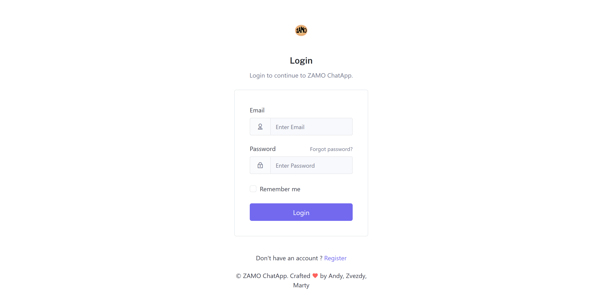
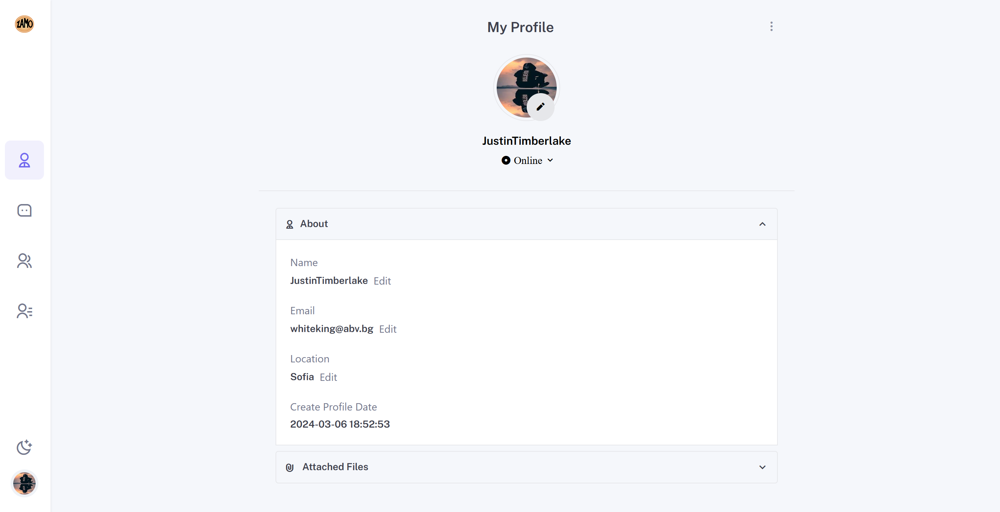
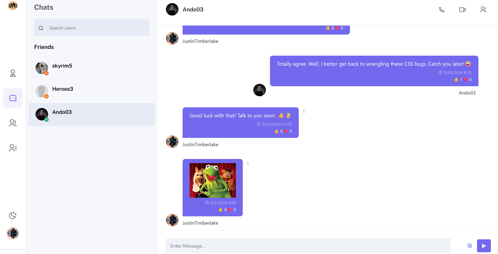
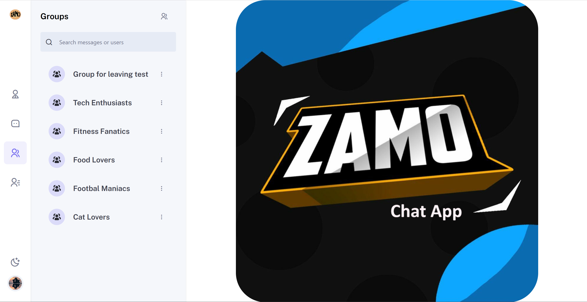
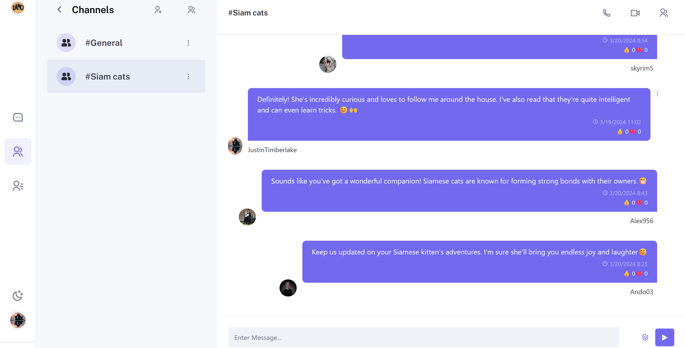

# ZAMO Chat App

### Description

Zamo is a cutting-edge application crafted for today's dynamic individuals and teams. Designed with modernity in mind, Zamo offers a comprehensive solution for real-time communication and collaboration. Whether it's chat, voice, or video calls, our platform ensures seamless interaction among users. Share information, exchange resources, and spark discussions with ease. Zamo is more than just an app. It's your partner in fostering meaningful connections and collaborative success.

### Creators

- Andrey Raychev - [@Andrey-Raychev](https://github.com/Andrey-Raychev)
- Martin Andreev - [@Martin-Andreev-288](https://github.com/Martin-Andreev-288)
- Zvezda Neycheva - [@DreamersJS](https://github.com/DreamersJS)

### Technologies used

- JavaScript
- React
- HTML
- Tailwind CSS
- Dyte SDK
- Firebase
- ESLint
- git

### Instalation

```
npm install
```

### Run the application

```
npm run start
```

### Usage

- **Public Interface: Where Engagement Begins**
  <br />Zamo's public section greets users with a simple and efficient Login page, ensuring existing users securely access their accounts and new users navigate an intuitive registration process. Designed with user experience in mind, this entry point facilitates a smooth transition into Zamo's realm of advanced communication and collaboration.

      

    <br/>

- **Profile Panels: Personalizing Communication for Users**
  <br />Users have a profile panel which enables them to edit their Name, Email and Location. Users can also change their avatar and status.

 
 <br />

- **Chat Interface: Where Conversations Flourish**
  <br />Zamo's chat interface provides users with a dynamic space for direct messaging with friends. Users can easily search for contacts, start one-on-one conversations, and utilize audio and video features. Adding reactions to messages adds expressiveness, while the ability to edit or delete messages gives users control over their communication.


<br/>

- **Groups: Cultivating Collaborative Communities**
  <br />Zamo enables users to build stronger connections by creating and managing their own groups. During setup, users can add participants exclusively from their friend list, tailoring groups to specific interests or topics. Users have full control over their groups, with the ability to delete or leave them as needed, ensuring participation aligns with preferences and needs, creating a dynamic community environment.


<br/>

- **Channels: Enriching Group Conversations**
  <br/>Upon the creation of a group in Zamo, a default #General channel is automatically established, serving as the foundational space for group discussions. However, the platform goes beyond this by empowering users with the capability to create additional channels within each group.
  <br/>The channels operate similarly to direct chats but are distinct in their facilitation of group conversations, allowing multiple users to engage with each other simultaneously.This feature is ideal for organizing discussions around specific topics, projects, or interests within the larger group context. Users who create channels retain the authority to delete them.


<br/>

- **Contacts: Your Hub for Connections**
  The Contacts page in Zamo acts as a central hub for managing and expanding your friend network. It features a comprehensive list of current friends with an easy-to-use search function. Adding friends directly from this page streamlines the process, making your network easily accessible. Incoming friend requests are prominently displayed, simplifying the process of welcoming new connections into your circle.


<br/>
